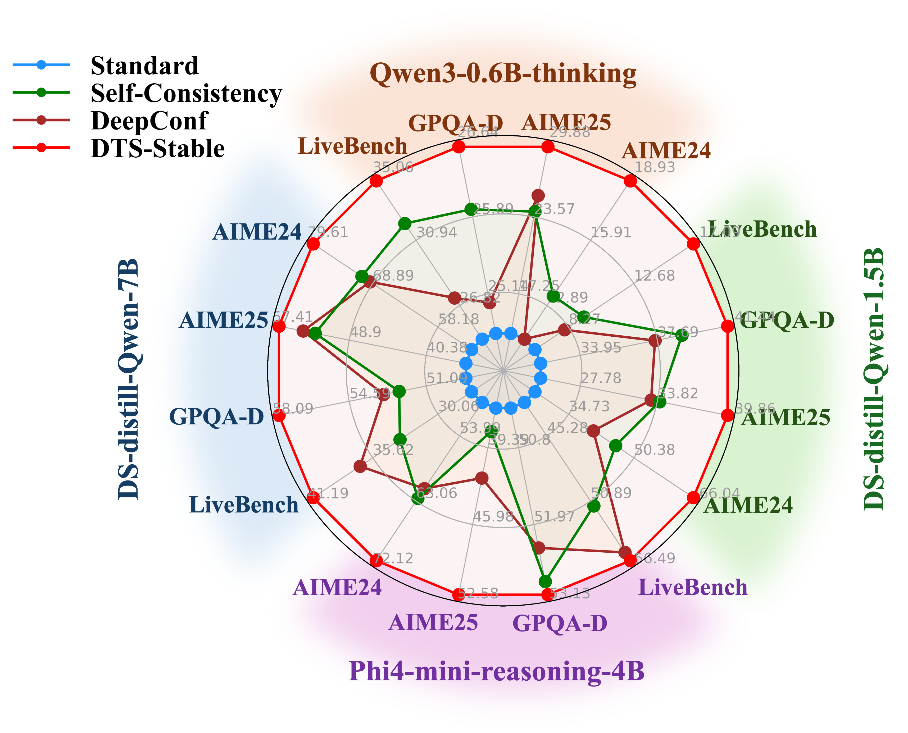
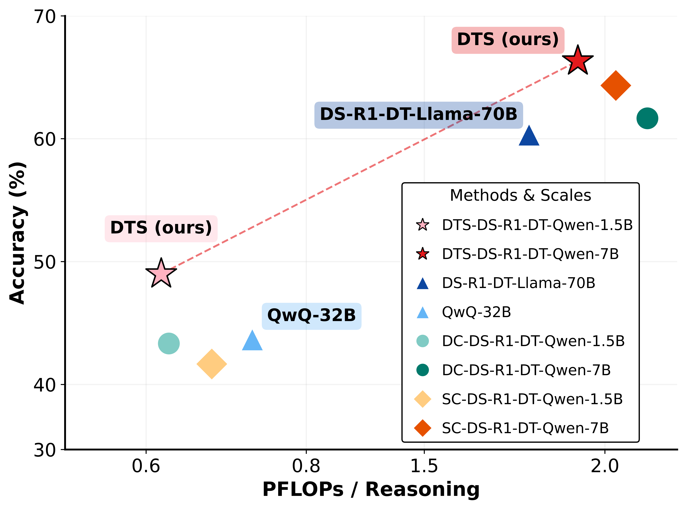
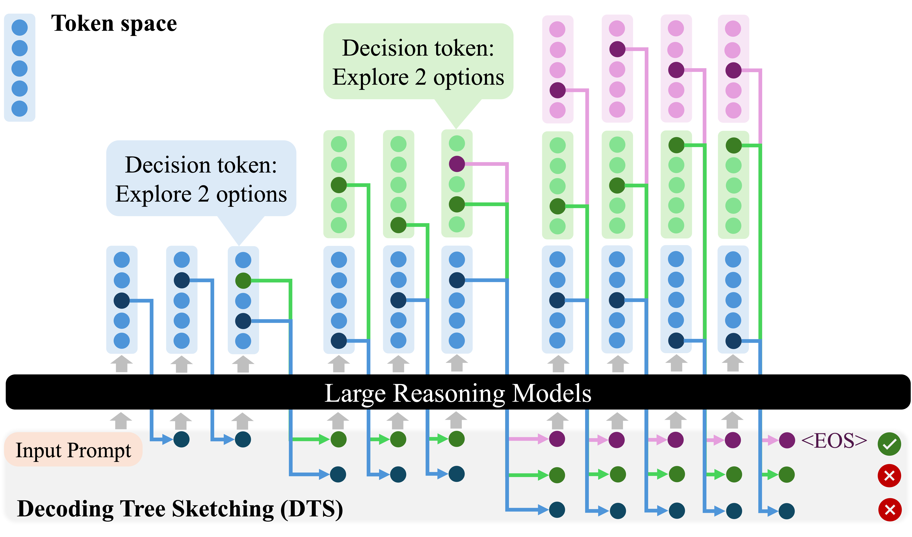
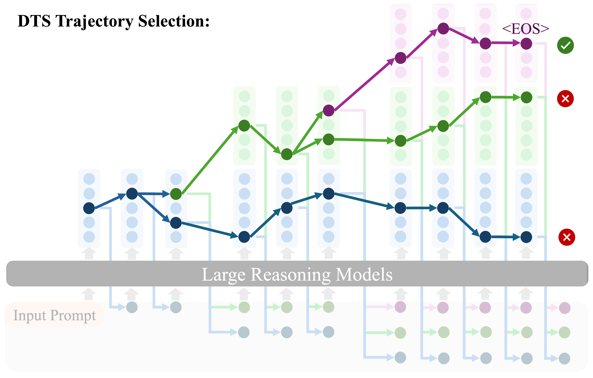

<div align="center">
<h1 align="center">
  
  Decoding Tree Sketching (DTS)
</h1>
<h3><em>Enhancing Large Reasoning Models via Structured Exploration</em></h3>
<p align="center" style="margin-bottom: 0px;">
    <a href="https://arxiv.org/abs/2511.00640"></a><a href="#"></a><a href="https://colab.research.google.com/github/ZichengXu/Decoding-Tree-Sketching/blob/main/notebooks/example_DeepSeek_R1_Distill_Qwen_1_5B.ipynb"></a><a href="#"></a><a href="#"></a>
</p>
<p align="center" style="font-size: 10px;">
    <a href="#-updates" style="text-decoration: none; font-weight: bold;">🎉 Updates</a> •
    <a href="#-about" style="text-decoration: none; font-weight: bold;">💡 About</a> •
    <a href="#-clone-and-use-dts" style="text-decoration: none; font-weight: bold;">🔍 Clone and Use DTS</a>
    <a href="#-experiments" style="text-decoration: none; font-weight: bold;">🧪 Experiments</a> •
    <a href="#-how-dts-works" style="text-decoration: none; font-weight: bold;">🚀 How DTS Works</a> •
    <a href="#-citation" style="text-decoration: none; font-weight: bold;">💬 Citation</a>
</p>

</div>

## 🎉 Updates
- **[02/09/2026]** **Codebase Update:** We have updated the codebase to match the latest version.
- **[02/04/2026]** **Paper Update:** We have uploaded the latest version of our paper to arXiv. Check it out [here](https://arxiv.org/abs/2511.00640).
- **[11/03/2025]** 📣 Released DTS on Colab! [](https://colab.research.google.com/github/ZichengXu/Decoding-Tree-Sketching/blob/main/notebooks/example_DeepSeek_R1_Distill_Qwen_1_5B.ipynb)
- **[11/01/2025]** 📣 Released our Paper on arXiv. See [here](https://arxiv.org/abs/2511.00640).
- **[10/29/2025]** ✨✨ Full codebase of DTS released.


## 💡 About

**Decoding Tree Sketching (DTS)** is a **Training-free** decoding framework designed to unlock the full potential of Large Reasoning Models (LRMs) through structured exploration and reliable trajectory selection. By sketching a dynamic reasoning tree and leveraging the **length-accuracy anti-correlation**, DTS delivers:

- **Significant Accuracy Gains:** Achieves an average accuracy improvement of **14%** across four datasets; Consistently surpassing SOTA parallel thinking baselines, with peak improvements of up to **18.67%** on AIME24.
- **Superior Inference Scaling:** Enables smaller models to outperform flagship models **10x** their size (e.g.,  DeepSeek-Distill-Qwen-7B with DTS surpasses DeepSeek-Distill-Llama-70B) at similar compute budgets.
- **Mitigated Repetition:** Effectively prevents reasoning loops, reducing repetitive generation by **8%** on average.

<div align="center">
  
  &nbsp; &nbsp; &nbsp; &nbsp; &nbsp; &nbsp; &nbsp; &nbsp; &nbsp; &nbsp; 
  
</div>

## 🏃‍♂️🏃🏻‍♂️🏃🏾‍♂️ Run DTS on Colab 
Run DTS on DeepSeek-R1-Distill-Qwen-1.5B with Colab [](https://colab.research.google.com/github/ZichengXu/Decoding-Tree-Sketching/blob/main/notebooks/example_DeepSeek_R1_Distill_Qwen_1_5B.ipynb)


## 🚀 Clone and Use DTS
DTS is a **plug-and-play** module designed for reasoning models on Hugging Face.
Simply clone this repository to instantly enhance your model’s reasoning capabilities!

#### 1\. Environment Setup

```bash
git clone https://github.com/ZichengXu/Decoding-Tree-Sketching.git
cd Decoding-Tree-Sketching
conda create -n dts python=3.10
conda activate dts
pip install -e .
```

#### 2\. Run Example
This example shows how to load a model and run inference with DTS-Greedy decoding.

```python
import torch
from transformers import AutoModelForCausalLM, AutoTokenizer, TextStreamer, set_seed
from decoding_tree_sketching.kvbatch_decoder import KVBatchEGDT
from decoding_tree_sketching.utils.eval_utils import extract_answer_llm

model_name = "deepseek-ai/DeepSeek-R1-Distill-Qwen-1.5B"

# Decoding hyperparameters
DECODE_CONFIG = {
    "entropy_threshold": 2.5,
    "branch_top_k": 3,
    "max_active_hyps": 12,
    "max_new_tokens": 5000,
    "temperature": 0.6,
    "num_traces": 1,
}
tokenizer = AutoTokenizer.from_pretrained(
        model_name,
        trust_remote_code=True
    )
model = AutoModelForCausalLM.from_pretrained(
    model_name,
    device_map="cuda" if torch.cuda.is_available() else torch.device("cpu"),
    torch_dtype="auto",
    trust_remote_code=True
)
streamer = TextStreamer(tokenizer)

examples = [
  "Six points $A, B, C, D, E,$ and $F$ lie in a straight line in that order. Suppose that $G$ is a point not on the line and that $AC=26, BD=22, CE=31, DF=33, AF=73, CG=40,$ and $DG=30.$ Find the area of $\\triangle BGE.$",
]
groundtruths = [
    "468",
]
reasoning_tail = r" Please reason step by step, and put your final answer within \boxed{}."
seed = 1

set_seed(seed)
ques_idx = 0
example = examples[ques_idx]
groundtruth = groundtruths[ques_idx]
full_prompt = example + reasoning_tail
text = tokenizer.apply_chat_template(
    [{"role": "user", "content": full_prompt}],
    tokenize=False,
    add_generation_prompt=True
)

# Standard output
inputs = tokenizer(text, return_tensors="pt").to(model.device)
out = model.generate(
    **inputs,
    max_new_tokens=DECODE_CONFIG["max_new_tokens"],
    do_sample=True,
    temperature=DECODE_CONFIG["temperature"],
    streamer=streamer,
)

num_new_tokens = out[0].shape[0] - inputs["input_ids"].shape[1]
stat = tokenizer.decode(out[0][inputs["input_ids"].shape[1]:], skip_special_tokens=True)
ans = extract_answer_llm(stat)
print(f"Groundtruth = {groundtruth}, Regular decoding output = {ans}")

kvegdt = KVBatchEGDT(model, tokenizer, seed=seed)
dts_out = kvegdt.generate(
        text,
        entropy_threshold=DECODE_CONFIG["entropy_threshold"],
        branch_top_k=DECODE_CONFIG["branch_top_k"],
        max_active_hyps=DECODE_CONFIG["max_active_hyps"],
        max_new_tokens=DECODE_CONFIG["max_new_tokens"],
        temperature=DECODE_CONFIG["temperature"],
        num_traces=DECODE_CONFIG["num_traces"],
    )

print(f"\n*** GENERATION STATS ***\n{dts_out['stats']}")
dts_ans = extract_answer_llm(dts_out['text'])
print(f"Groundtruth = {groundtruth}, DTS output = {dts_ans}")      
```


## 🎯 Paper Results

DTS consistently outperforms baselines—including multi-trajectory methods—by utilizing selective branching and early termination to steer decoding toward optimal solutions. As a training-free framework, it proves model-agnostic across various LRM families and demonstrates strong task generalization, extending robust accuracy gains beyond mathematics to diverse domains like science and logic. 

Accuracy (%) and Improvement (↑) of **DTS** compared to baselines on AIME24, AIME25, GPQA-D, and LiveBench datasets:

| Model | Method | AIME24 (Imp.) | AIME25 (Imp.) | GPQA-D (Imp.) | LiveBench (Imp.) | Average (Imp.) |
| :--- | :--- | :---: | :---: | :---: | :---: | :---: |
| **DS-Distill-Qwen-1.5B** | Standard Inference | 26.67 (0.00) | 24.67 (0.00) | 32.02 (0.00) | 6.00 (0.00) | 22.34 (0.00) |
| | DeepConf-low | 46.00 (+19.33) | 34.00 (+9.33) | 38.89 (+6.87) | 9.30 (+3.30) | 32.05 (+9.71) |
| | **DTS-Stable** | **64.67 (+38.00)** | **39.33 (+14.66)** | **41.11 (+9.09)** | **16.70 (+10.70)** | **40.45 (+18.11)** |
| **DS-Distill-Qwen-7B** | Standard Inference | 52.67 (0.00) | 36.00 (0.00) | 49.29 (0.00) | 27.20 (0.00) | 41.29 (0.00) |
| | DeepConf-low | 70.67 (+18.00) | 52.67 (+16.67) | 52.32 (+3.03) | 33.30 (+6.10) | 52.24 (+10.95) |
| | **DTS-Stable** | **78.67 (+26.00)** | **56.67 (+20.67)** | **57.78 (+8.49)** | **40.70 (+13.50)** | **58.45 (+17.16)** |
| **Qwen3-0.6B** | Standard Inference | 11.33 (0.00) | 14.00 (0.00) | 24.75 (0.00) | 24.70 (0.00) | 18.70 (0.00) |
| | DeepConf-low | 13.33 (+2.00) | 24.00 (+10.00) | 25.96 (+1.21) | 32.00 (+7.30) | 23.82 (+5.13) |
| | **DTS-Stable** | **18.67 (+7.34)** | **29.33 (+15.33)** | **26.57 (+1.82)** | **34.70 (+10.00)** | **27.32 (+8.62)** |
| **Phi4-mini-reasoning-4B** | Standard Inference | 49.33 (0.00) | 36.00 (0.00) | 50.20 (0.00) | 42.40 (0.00) | 44.48 (0.00) |
| | DeepConf-low | 62.67 (+13.34) | 38.00 (+2.00) | 52.83 (+2.63) | 51.30 (+8.90) | 51.20 (+6.72) |
| | **DTS-Stable** | **71.33 (+22.00)** | **52.00 (+16.00)** | **53.03 (+2.83)** | **56.00 (+13.60)** | **58.09 (+13.61)** |


> **Note:** This table presents a selected subset of our experimental results. For the full comparison, please refer to Table 1 in our [Paper](https://arxiv.org/abs/2511.00640). **Bold** indicates the best performance.

## 🧪 Experiments

Our experimental workflow is designed to be configurable and reproducible. 

#### 1\. Reproduce Our Results

To reproduce main results from the paper, use the provided bash scripts in the `scripts/` directory.
These scripts automatically loop through all combinations of `models` and `datasets` and pass the correct, paper-matched hyperparameters for each run.

```bash
bash scripts/run_all_dts.sh # DTS
bash scripts/run_all_std.sh # baseline
```
The hyperparameters within these scripts are hard-coded to match our paper's settings.

> **Note:** Our experiments were conducted on NVIDIA H200 GPUs. Results may vary slightly depending on your specific hardware configuration.

#### 2\. Configuration File (`configs/config.yaml`)

This file contains all fundamental configuration settings, such as model names, dataset paths, output directories, and default parameters tailored for each dataset. You can edit this file to change the models, datasets, or prompts. 

<!-- to set your own paths and related parameters. -->
<!-- The core logic is in `decoding_tree_sketching/run_experiment.py`, which reads model/dataset configurations from `configs/config.yaml` and accepts hyperparameters from the command line. -->


#### 3\. Running a Experiment (Manual)

You can also call `decoding_tree_sketching/run_experiments.py` directly to run custome experiments or test different hyperparameters.

**Command Template:**

```bash
python decoding_tree_sketching/run_experiments.py [mode] --model_name [model] --dataset_name [dataset] [OPTIONS]
```

**Argument Explanations:**

* `[mode]`: `dts` or `standard`.
* `--model_name`: The model key from `configs/config.yaml` (e.g., `1.5B`).
* `--dataset_name`: The dataset key from `configs/config.yaml` (e.g., `aime24`).
* `[OPTIONS]`:
  * `-e`, `--entropy_threshold`: **[DTS only]** The entropy threshold to trigger branching.
  * `-v`, `--varentropy_threshold`: **[DTS only]** The varentropy threshold to trigger branching.
  * `-k`, `--branch_top_k`: **[DTS only]** The number of new branches (top-K tokens) to create when entropy exceeds the threshold.
  * `-a`, `--max_active_hyps`: **[DTS only]** The maximum number of active hypotheses (branches) to maintain during decoding.
  * `--num_traces`: **[DTS-Stable]** The voting budget $B$ (number of completed trajectories to collect before voting). Set to `1` for DTS-Greedy.
  * `-m`, `--max_new_tokens`: Maximum tokens that can be generated.
  * `-s`, `--seed`: Initial random seed.
  * `-n`, `--num_trials`: Number of trials for the repeated experiment.
  * `-t`, `--temperature`: Sampling temperature.

**Example (DTS-Stable on 7B model for AIME24):**

```bash
python decoding_tree_sketching/run_experiment.py dts \
    --model_name "7B" \
    --dataset_name "aime24" \
    -e 2.5 \
    -v 1.5 \
    -k 3 \
    -a 12 \
    --num_traces 8 \
    -m 32768 \
    -t 0.6 \
    -s 0 \
    -n 5
```

#### 4\. Extending to Other Models or Datasets

To add new models or datasets, you will need to modify the following files:

1.  **`configs/config.yaml`**:

      * **Add new models:** Add a new entry under the `models:` section.
      * **Add new datasets:** Add a new entry under the `datasets:` section. You must provide the template for your new model/dataset pair.

2.  **`decoding_tree_sketching/run_experiment.py`**:

      * The evaluation logic (e.g., `extract_answer_qwq`) is specific to the `\boxed{}` format. You will need to update the evaluation loop to use the correct answer extraction logic for your new dataset.


## 🔍 How DTS Works

DTS sketches a structured reasoning tree by selectively branching at critical decision points and applies early termination to prioritize the most reliable reasoning paths. The design of DTS is driven by two critical findings regarding LRM behavior:

- **Length-Accuracy Anti-correlation**: Empirical analysis reveals that shorter reasoning trajectories* consistently achieve higher accuracy. This phenomenon is theoretically grounded in RL post-training objectives, which implicitly favor concise correct reasoning over long, rambling chains.

- **Selective Branching at "Decision Tokens"**: Instead of branching at generic high-uncertainty points, DTS identifies specific "Decision Tokens" where the model wavers between distinct reasoning directions. These tokens are mathematically characterized by high varentropy (indicating semantic competition) and low entropy (indicating focused confidence on a few paths).

DTS offers two decoding strategies to balance efficiency and stability:

* **DTS-Greedy:** It follows a greedy stopping rule, terminating immediately once the first candidate trajectory completes. This strategy leverages the insight that shorter reasoning paths are often more reliable.
* **DTS-Stable:** Enhances robustness by collecting a voting budget of the earliest completed trajectories and employing majority voting to select the final answer. This approach maintains the preference for concise reasoning while reducing sensitivity to stochastic variations.
  
The figure below illustrates **(a) Generation of the decoding tree by DTS.** Starting from the input prompt, DTS first follows standard auto-regressive decoding, producing a single branch (**blue**). At decision tokens, DTS generates new branches (**green** and **purple**) by selecting top- candidate tokens. Each branch expands in parallel across its own token space. **(b) DTS trajectory selection via early termination.** All branches share prefix computation up to their branching points. DTS prioritizes the earliest completed branches that reach the end-of-sequence token (**purple**).

<div align="center">
  
  &nbsp; &nbsp; &nbsp; &nbsp; 
  
</div>

## 🫡 Acknowledgement

We also acknowledge [Entropix](https://github.com/xjdr-alt/entropix), an open-source package exploring entropy-based sampling for Chain-of-Thought (CoT) decoding. 

<!-- Its work on leveraging uncertainty signals during generation is closely related to our motivation for entropy-guided reasoning efficiency. -->
<!-- Acknowledge to [entropix], another open-source package for entropy-based sampling for CoT decoding. -->


## 💬 Citation

If you find DTS helpful, please cite the paper and star this repo, thanks!

```bibtex
@article{xu2025dts,
  title={DTS: Enhancing Large Reasoning Models via Decoding Tree Sketching},
  author={Xu, Zicheng and Wang, Guanchu and Chuang, Yu-Neng and Zheng, Guangyao and Szalay, Alexander S and Liu, Zirui and Braverman, Vladimir},
  journal={arXiv preprint arXiv:2511.00640},
  year={2025}
}
```


